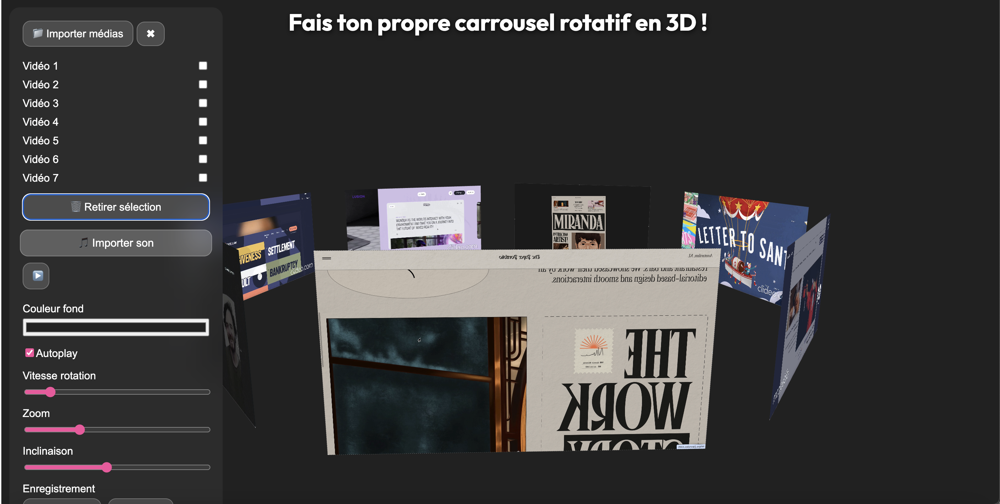
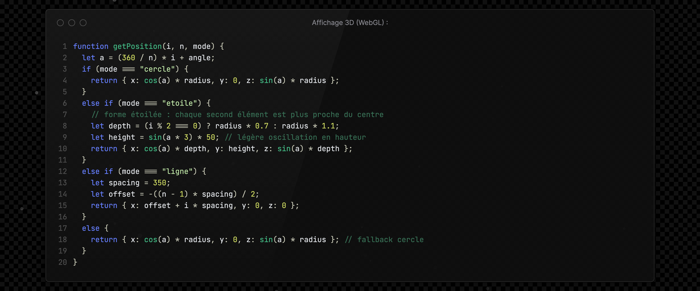
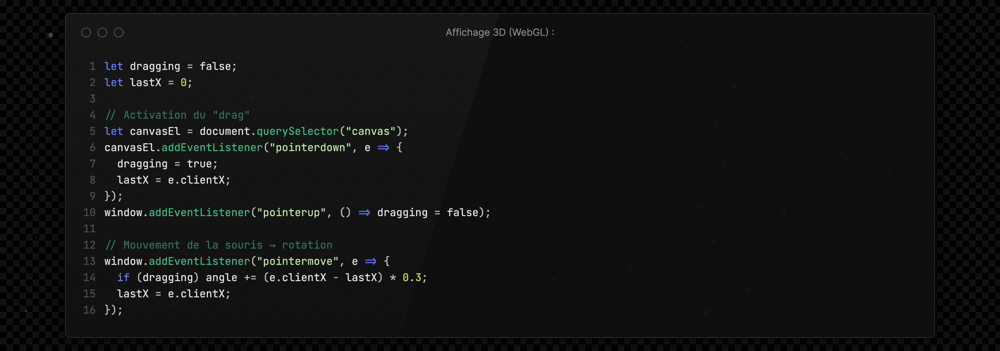
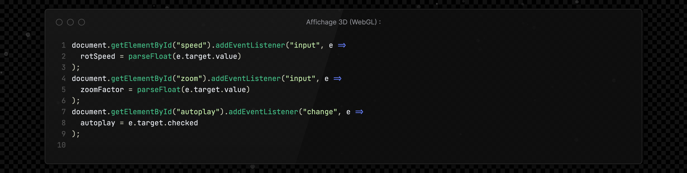
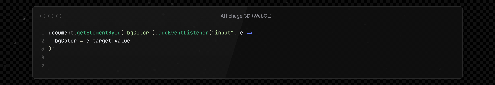
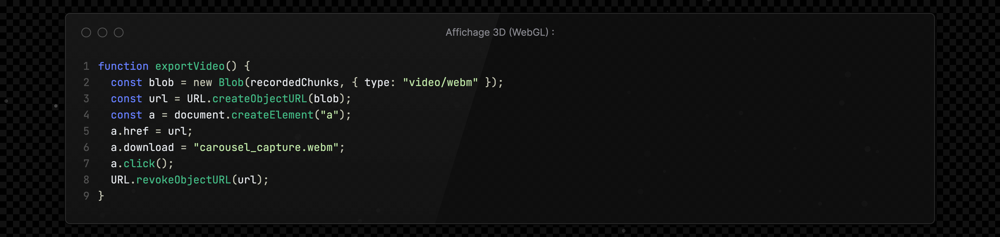

# Carrousel 3D intéractif - Creative Coding

## L'idée 
- Transformer ses images ou vidéos en un **carrousel 3D interactif** et personnalisable,
- Importer ses médias, modifier l’apparence (fond, vitesse, zoom, rotation),
- Exporter le rendu en vidéo téléchargeable.

Référence : [Lien de l'inspiration](https://fr.pinterest.com/pin/649644315050761798/)

## Le pitch  
Un outil créatif et intuitif qui génère une **animation 3D rotatif** à partir de contenus visuels personnels, vidéo et photos.  
→ L’utilisateur peut glisser-déposer ses fichiers, contrôler la rotation manuellement ou en mode automatique, ajuster le fond et capturer le rendu final sous forme de vidéo prête à partager ou intégrer !

## Les fonctionnalités principales (snippets)
* **Importation multiple** : images ou courtes vidéos via sélection ou glisser-déposer.

* **Affichage 3D (WebGL)** : disposition circulaire des médias sur des plans en rotation (effet carrousel).  

* **Contrôles interactifs** :  
  * 🖱️ **Drag** → rotation manuelle 

  * 🧭 **Molette** → zoom avant/arrière  

  * 🎚️ **Curseurs** → vitesse, zoom, activation/désactivation de l’autoplay 
 
* **Personnalisation visuelle** :  
  * 🎨 Choix d’un fond coloré via *color picker*  

  
* **Export vidéo** : sauvegarde automatique en `.webm`

Géré grâce à la MediaRecorder API, native du navigateur :

Export :

## Son UI / UX  

* **Interface épurée** : un panneau latéral réunit les contrôles essentiels, tandis que la zone principale affiche le carrousel en temps réel.  
* **Retour visuel immédiat** : chaque modification (vitesse, fond, ajout d’image) s’applique instantanément.  
* **Prise en main fluide** : valeurs par défaut, mais contrôle précis pour les utilisateurs avancés.  

## Les évolutions possibles  

* Ajout de **formes alternatives** faites avec les images (étoile, spirale, grille dynamique)  
* Intégration de **filtres visuels ou effets de transition**  
Références d'idée d'amélioration : [Lien de l'inspiration](https://fr.pinterest.com/pin/278589926953392048/)
* Export direct en **.mp4**  
* Personnalisation avancée du fond (image, dégradé, vidéo, environnement 360°) 

## Les technologies  
* **p5.js (WebGL)** — rendu 3D interactif  
* **JavaScript (ES6)** — logique et interactions  
* **HTML / CSS** — structure et interface utilisateur  
* **MediaRecorder API** — capture vidéo du canvas

Projet réalisé dans le cadre du cours **Creative Coding** 
— ICAN Paris **Océane DOS SANTOS**
